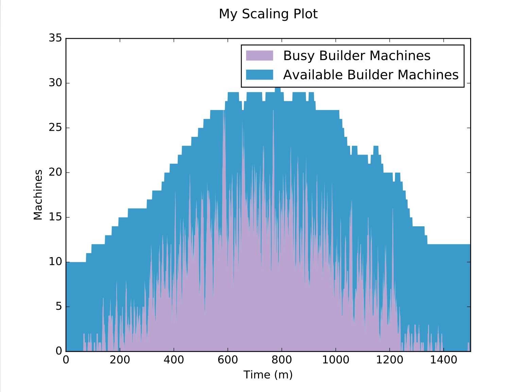

asg-sim
=======

[](https://circleci.com/gh/bellkev/asg-sim/tree/master)

A simple computational model of build clusters with various parameters
under varying workloads, either of a fixed size or dynamically scalable
according to the rules of [AWS Auto Scaling groups](https://aws.amazon.com/autoscaling/).

For more background, see the related [blog series](https://circleci.com/blog/mathematical-justification-for-not-letting-builds-queue/).

## Example Usage

```python
>>> from asgsim.model import Model, run_model
>>> from asgsim.plots.utils import make_scaling_plot
>>> help(Model)
```
```
 |  A simplified model of a CircleCI Enterprise builder ASG.
 |
 |  Available parameters:
 |
 |  (all times are integer numbers of seconds unless noted otherwise)
 |
 |  build_run_time: execution time of every build
 |  builder_boot_time: boot time of builders (except initial builders)
 |  builds_per_hour: float of average builds/hour
 |  builds_per_hour_fn: designates time-varying function with builds_per_hour is multiplied
 |                      options are Model.CONSTANT (always 1) or Model.SINE (a sinusoid
 |                      that starts at the minimum of 0 at t=0 and peaks at 1 at t=12hrs)
 |  initial_builder_count: number of builders to boot instantly at start
 |  sec_per_tick: number of seconds per "tick" on the model clock
 |  ticks: number of "ticks" (cycles) to run the model
 |  autoscale: boolean that enables autoscaling and supports these additional params:
 |      alarm_period_duration: duration of one (CloudWatch-style) alarm period
 |      scale_down_alarm_period_count: number of alarm periods metric must be under threshold
 |                                     before scale down alarm goes off
 |      scale_down_change: number of instances to turn off for each scale-down event
 |      scale_down_threshold: number of available instances above which scale-down events fire
 |      scale_up_alarm_period_count: number of alarm periods metric must be over threshold
 |                                     before scale down alarm goes off
 |      scale_up_change: number of instances to start for each scale-up event
 |      scale_up_threshold: number of available instances below which scale-up events fire
 |
 |  Current significant simplifications are:
 |  - No containers: Only one build at a time per builder
 |  - Only one type of build: Every build takes exactly the same integer number
 |    of seconds
 |  - Assumes traffic is random: Random traffic is generated according to a
 |    Poisson distribution, optionally multiplied by build_per_hour_fn so things like
 |    repeated builds to detect flaky tests will not be modeled
```

```python
>>> params = {'builder_boot_time': 300,
...           'builds_per_hour': 200.0,
...           'build_run_time': 300,
...           'builds_per_hour_fn': Model.SINE,
...           'autoscale': True,
...           'alarm_period_duration': 300,
...           'scale_up_alarm_period_count': 1,
...           'scale_down_alarm_period_count': 4,
...           'scale_up_threshold': 10,
...           'scale_down_threshold': 12,
...           'scale_up_change': 1,
...           'scale_down_change': 1,
...           'initial_builder_count': 10,
...           'sec_per_tick': 60,
...           'ticks': 1500}
>>> m = run_model(**params)
>>> m.mean_queue_time()
0.05128850779598571
>>> make_scaling_plot(params, 'My Scaling Plot', 'fig')
```

